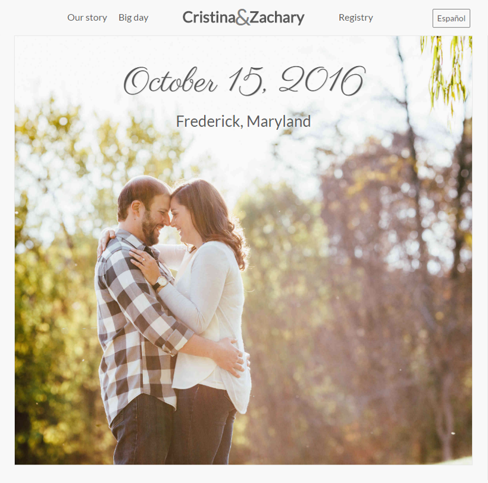
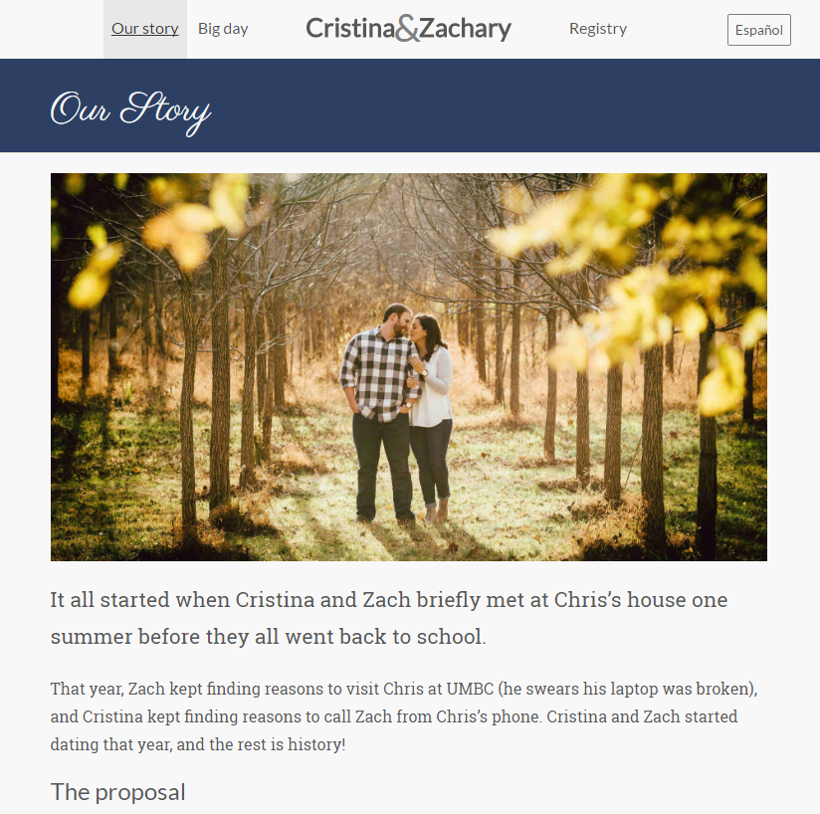

This was the first project I did outside of work for someone other than myself
for quite some time, and it was for two of the most incredible people I know!
It is a static, Jekyll-based website, using Bootstrap as the front-end
framework, and supporting bilingual content (both English and Spanish).

